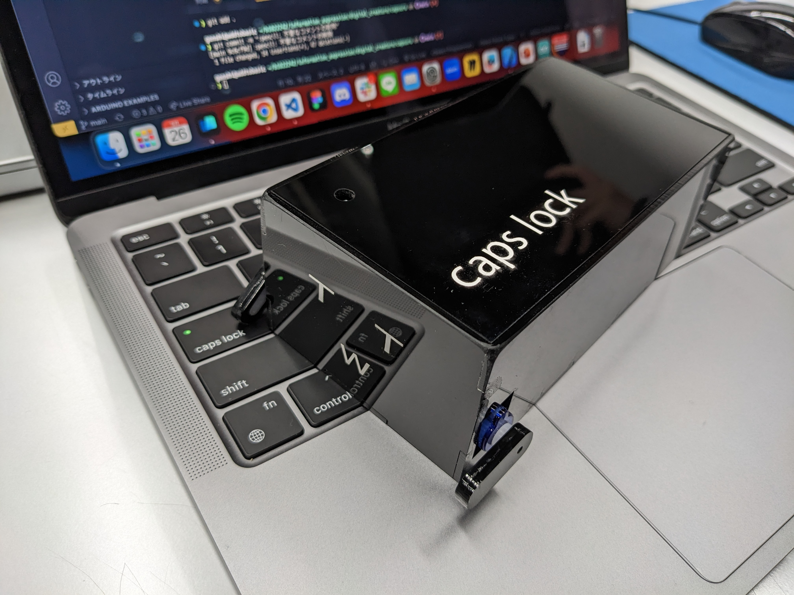

# capsuru
情報表現基礎Ⅱの未来大周辺に生息するデジタル仮想生物を作成するという課題での成果物.

# Requirement
* Arduino IDE
* Arduino Leonardo
* [VarSpeedServo](https://github.com/netlabtoolkit/VarSpeedServo)

# Presentation materials
発表資料は[こちら](https://docs.google.com/presentation/d/1PVnivjOPDEQ2YclTaF1ixyRShuqtrnx4/edit?usp=sharing&ouid=110452052910551516177&rtpof=true&sd=true)を御覧ください.
